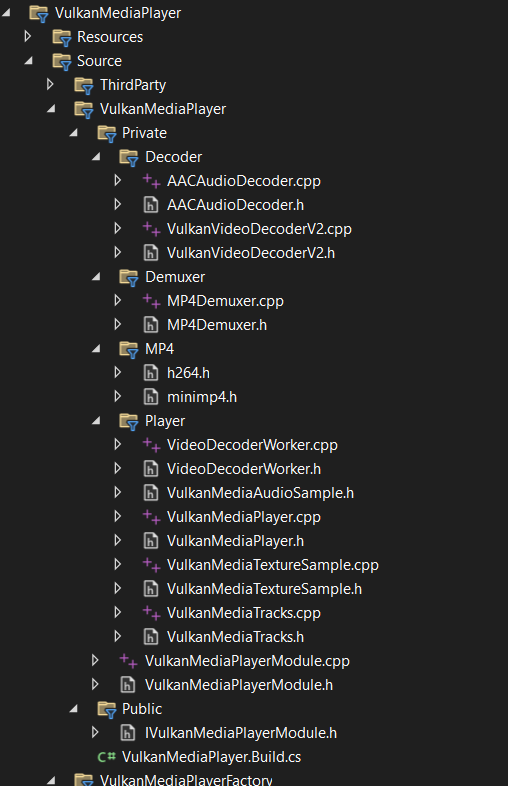

**Intro**

Some [Runtime Video Recorder](https://peterleontev.com/blog/unreal_video_encoding/) clients have crazy requirements: "Can you please add support for Linux and LinuxARM64 as well as GPU backed Video Playback"? And it is often in Mandarin :D 

How do I deal with these requests? Well, there are 3 scenarios: 
1. I will say NO. Mainly because implementation Burden is too much and I have other priorities wrt RVR.
2. I will say It DEPENDS. Often not so popular platforms (such as Linux) have sophisticated set up or constraints and I don't have access to related hardware. Sometimes I can still do it but this task requires upfront payment from the client.
3. I will say YES. However then I create a new product. And here we go - [Vulkan Media Player](https://www.fab.com/listings/b2fe4881-084b-4b6b-9142-f834ed7aab16) for Unreal 5 is completely free to use. You can finally play MP4 files on Linux from within Unreal without the need for FFMPEG or other sophisticated host environment configuration. And this approach is BLAZINGLY fast!

**Why use Vulkan Video in Unreal Engine**

Unreal Engine on Linux currently DOES NOT SUPPORT playing MP4 files out of the box. Yes, you heard that right, YOU CANNOT play MP4 files on Linux. Boo, Epic, Boo! 
The only options you have:
1. Use WebM format - slow and bad compression, convert all your MP4 files into WebM and pray.
2. Use sophisticated FFMPEG setup (might or might not work), but you can't expect all users have it installed!
3. Implement custom Media Player for playing MP4 files, hmm, are you somewhat aware of how Video encoding is done on Linux and constraints and that is extremely difficult to pull off without being a coding pro? Bare minimum implementation is 3k+ lines of code!

Thus I deciced to create a brand new MP4 Player compatible with Unreal Engine 5 and Linux! I named it Vulkan Media Player because it uses [Vulkan Video API](https://www.khronos.org/blog/an-introduction-to-vulkan-video), which is steadily growing and supported by practically all consumers GPUs out there. It nicely abstracts away the need to install ANY kind of third-party software and this means your Unreal Engine apps can ship as is.

**Warning**

Whatever you plan to do with Vulkan Video - it won't be [a walk in the park](https://wickedengine.net/2023/05/vulkan-video-decoding/) as lead developer of [Wicked Engine](https://wickedengine.net/) János Turánszki wrote a while ago. Main reason is Vulkan Video is very complicated API to deal with. Moreover, H264 video encoding/decoding adds such a huge overhead just because Video codecs are almost like a rocket science.

**Architecture of Vulkan Media Player and Unreal Engine boilerplate** 

Take a look at this code structure. Devil in the details, I am telling you. VulkanVideoDecoderV2 alone is 3200+ lines of Vulkan Video Decode specific C++ code.  

The Vulkan Media Player plugin follows a modular architecture. The system is built around Unreal Engine's Media Framework and leverages Vulkan Video API for GPU-accelerated video decoding. I put it as "Unreal Engine boilerplate" because Unreal Engine Media Framework code required to support Vulkan Video is not that bad in comparison to Vulkan, ha-ha. I have to admit, I really hate Vulkan Video Decoding now, it is really HARD framework to use in your app!   

The plugin consists of several core components: `VulkanMediaPlayerFactory` registers the player with Unreal's Media Framework, `FVulkanMediaPlayer` implements the `IMediaPlayer` interface, `FMP4Demuxer` parses MP4 containers using libmp4v2, `FVulkanVideoDecoderV2` handles hardware-accelerated H.264/H.265 decoding, `FAACAudioDecoder` decodes AAC audio via fdk-aac, `FVideoDecoderWorker` orchestrates the background decoding pipeline, and `FVulkanMediaTracks` manages sample queues for the engine.

The data flows like this: MP4 file → Demuxer extracts packets → Vulkan Video Decoder produces GPU textures (NV12) → GPU shader converts to RGB → Tracks Manager delivers to Unreal's Media Framework. Audio follows a parallel path through fdk-aac to PCM samples.

**Implementation Challenges**

One of the first challenges was working with Vulkan Video API extensions. The API requires loading function pointers dynamically since video extensions aren't part of the core Vulkan loader. More interestingly, Unreal Engine's Vulkan RHI doesn't create a logical device with video extensions enabled. The solution was to create our own logical device from Unreal's physical device, enabling only the video-specific extensions we need (`VK_KHR_VIDEO_QUEUE_EXTENSION_NAME`, `VK_KHR_VIDEO_DECODE_QUEUE_EXTENSION_NAME`, etc.).

MP4 containers store H.264 video in AVCC format (length-prefixed NAL units), but Vulkan Video expects Annex B format (start code-prefixed). This conversion is critical and happens for every frame. The NALU length size must be extracted from the MP4's `avcC` box - using the wrong size causes decoding failures. Keyframes require prepending SPS/PPS NAL units with their Annex B start codes intact. This seemingly simple conversion turned out to be one of the most error-prone parts of the implementation.

H.264 B-frames are decoded out of order but must be displayed in presentation order. The decoder uses Picture Order Count (POC) to determine the correct display sequence. We implemented a reorder buffer that holds decoded frames until they can be output in POC order - B-frames depend on future reference frames, so we can't output them immediately.

The Decoded Picture Buffer (DPB) is crucial for H.264 decoding, storing reference frames used for prediction. A critical bug we encountered was using too many reference frames - some MP4 files specify a high `num_ref_frames` in the SPS, but using all of them causes "ghosting" artifacts where old frames bleed into new ones. The fix was to limit reference frame usage to `MaxNumRefFrames` from the SPS.

To avoid blocking the main thread, decoding runs on a background worker thread. However, GPU operations must happen on the render thread. The solution uses Unreal's task graph system - the decoder worker enqueues GPU operations using `ENQUEUE_RENDER_COMMAND`. A key performance optimization was keeping decoded frames on the GPU throughout the pipeline - Vulkan Video decodes directly into GPU textures (NV12 format), which are then converted to RGB using a GPU shader without ever touching CPU memory.

Not all MP4 files are created equal. Some encoders incorrectly mark all frames as sync samples in the MP4 index. The decoder must parse the actual NAL unit type from the bitstream to determine if a frame is truly a keyframe. Similarly, the NALU length size isn't always 4 bytes - we've seen files with 1-byte and 2-byte prefixes.

Rather than decoding the entire video upfront, the decoder uses time-based buffering within a 1-2 second read-ahead window. This prevents unnecessary decoding when seeking or pausing, and reduces memory usage. Initial profiling also revealed that fence waits were a bottleneck - the decoder now uses separate fences for decode and copy operations, allowing better pipelining.

**Lessons Learned**

1. **Always validate container metadata** - Don't trust keyframe flags or other metadata; parse the actual bitstream when possible.

2. **Reference frame limits matter** - Using more reference frames than specified in the SPS causes artifacts, not better quality.

3. **Thread boundaries are expensive** - Keep GPU operations on the GPU and minimize cross-thread synchronization.

4. **Extension APIs require careful setup** - Vulkan Video extensions need proper device creation and function loading; reference implementations (like mini_video) were invaluable for understanding the API.

5. **Test with diverse content** - Different encoders produce different MP4 structures; test with various sources to catch edge cases.

**Linux Vulkan Video Support**

The Vulkan Media Player plugin is primarily designed for Linux platforms (x86_64 and ARM64), leveraging robust Vulkan Video support available on modern Linux systems. Hardware-accelerated video decoding requires appropriate GPU drivers: NVIDIA proprietary drivers 470.xx+, AMD Mesa 22.0+ with RADV/AMDVLK, or Intel Mesa with ANV driver.

You can verify Vulkan Video support using `vulkaninfo | grep -A 20 "VkVideo"` and looking for `VK_KHR_video_queue` and `VK_KHR_video_decode_queue` extensions. The plugin creates its own Vulkan logical device with video extensions enabled, coexisting with Unreal Engine's Vulkan RHI without conflicts.

**Vibe-coding: How This Was Actually Built**

Here's the plot twist: I didn't write a single line of code myself. All 3200+ lines of Vulkan Video decoder code, the Unreal Engine Media Framework integration, the threading architecture - everything was generated through vibe-coding with [Cursor](https://cursor.sh/).

The process was essentially me describing what I needed (context is the king!) pointing at open-source reference implementations like [vk_video_samples](https://github.com/nvpro-samples/vk_video_samples) and [Wicked Engine's Vulkan Video code](https://github.com/turanszkij/WickedEngine), and letting the AI figure out the intricate details of DPB management, POC calculation, and AVCC to Annex B conversion. When something didn't work, I'd describe the symptoms, and Cursor would debug and fix it.

This is a testament to how AI-assisted development has matured. Complex systems that would normally take weeks of deep diving into Vulkan Video specs and H.264 documentation can now be built by someone who understands the architecture and requirements but doesn't want to manually wrestle with every NAL unit and reference frame. The AI handles the implementation details while you steer the ship.

Of course, this only works because excellent open-source implementations exist to learn from. Standing on the shoulders of giants, indeed!

If you wanna make your Unreal games play MP4 files on Linux, please download [Vulkan Media Player](https://www.fab.com/listings/b2fe4881-084b-4b6b-9142-f834ed7aab16) on FAB!