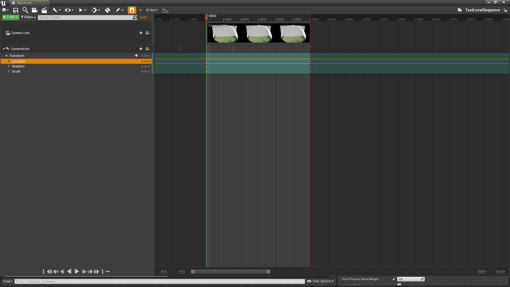
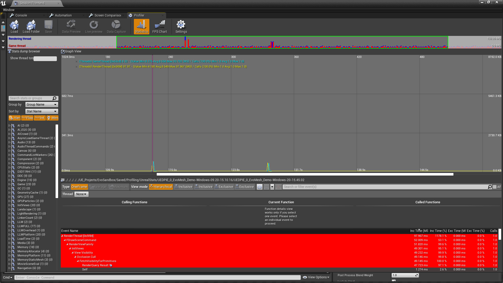
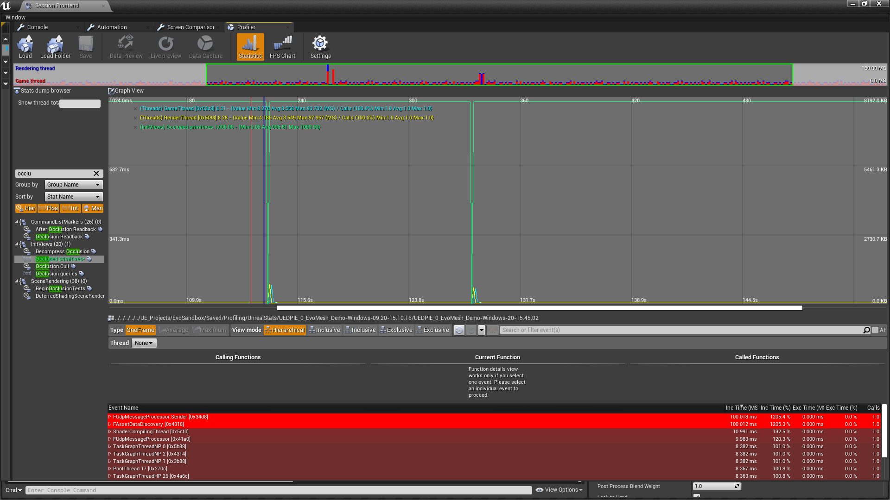
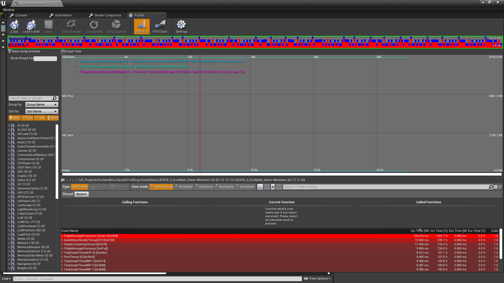

**Intro**

Unreal Engine 4 Level Sequence provides a great way to make in-game cinematics with ease. However, results sometimes are not desireable performance-wise. There are different reasons why this might happen, for example, high quality content, a lot of visible primitives in player frustrum but that is not all. Lets start look at facts that pop up during profiling.

**The history of the bug**

Lets look at a very simple test scene with a plane, 1000 static mesh objects placed behind it and no lighting actors (only HDRI backdrop). Expected behaviour is that the engine will occlusion cull 1000 static meshes as they are located begind the plane.


Now lets create a very simple level sequence where camera switches from game to sequence one and back but its position, rotation and other view parameters are not changed.



Although one expects nothing bad should happen (right?) _there is an issue_. Lets look at the image below to get more insights.



Profiling stats indicate that two render thread hitches are present and what is important that is exactly the number of times camera switches when playing the level sequence. Looking more at stats it seems that render thread hitches caused by _~50ms occlusion cull_... which is strange as camera transform didn't change at all! Lets add _Occluded primitives_ graph to the image.



In turns out that zero objects being occluded when camera switches from a game to cinematic one and back. _As a result the engine renders all 1000 static meshes objects behind the plane_. Really bad, right? Lets dive into the engine code.

**Chasing root cause of the bug**

Go to SceneVisibility.cpp function called _FetchVisibilityForPrimitives_Range_:

```cpp
static void FetchVisibilityForPrimitives_Range(FVisForPrimParams& Params, FGlobalDynamicVertexBuffer* DynamicVertexBufferIfSingleThreaded)
```

One branch of the function above can make the engine renderer completely ignore occlusion history for primitives:

```cpp
if (View.bIgnoreExistingQueries)
{
    // If the view is ignoring occlusion queries, the primitive is definitely unoccluded.
    // already set bIsOccluded = false;
    bOcclusionStateIsDefinite = View.bDisableQuerySubmissions;
}
```

_bIgnoreExistingQueries_ can be set to _true_ only during _FSceneRenderer::PreVisibilityFrameSetup(...)_ execution:

```cpp
// HighResScreenshot should get best results so we don't do the occlusion optimization based on the former frame
extern bool GIsHighResScreenshot;
const bool bIsHitTesting = ViewFamily.EngineShowFlags.HitProxies;
// Don't test occlusion queries in collision viewmode as they can be bigger then the rendering bounds.
const bool bCollisionView = ViewFamily.EngineShowFlags.CollisionVisibility || ViewFamily.EngineShowFlags.CollisionPawn;
if (GIsHighResScreenshot || !DoOcclusionQueries(FeatureLevel) || bIsHitTesting || bCollisionView)
{
    View.bDisableQuerySubmissions = true;
    View.bIgnoreExistingQueries = true;
}

// ...
const float DeltaTime = View.Family->CurrentRealTime - ViewState->LastRenderTime;
const bool bFirstFrameOrTimeWasReset = DeltaTime < -0.0001f || ViewState->LastRenderTime < 0.0001f;
// ...
// detect conditions where we should reset occlusion queries
if (bFirstFrameOrTimeWasReset ||
    ViewState->LastRenderTime + GEngine->PrimitiveProbablyVisibleTime < View.Family->CurrentRealTime ||
    View.bCameraCut ||
    View.bForceCameraVisibilityReset ||
    IsLargeCameraMovement(
        View,
        ViewState->PrevViewMatrixForOcclusionQuery,
        ViewState->PrevViewOriginForOcclusionQuery,
        GEngine->CameraRotationThreshold, GEngine->CameraTranslationThreshold))
{
    View.bIgnoreExistingQueries = true;
    View.bDisableDistanceBasedFadeTransitions = true;
}
```

The first set of conditions is not related to the bug since making high resolution screenshots, occlusion queries mechanism being disabled, performing hit testing or drawing collision do not happen when playing the level sequence.

The second set is more interesting though as it covers the following conditions:

1. The first frame OR the time was reset

```cpp
bFirstFrameOrTimeWasReset
```

2. Primitive is not visible anymore

```cpp
ViewState->LastRenderTime + GEngine->PrimitiveProbablyVisibleTime < View.Family->CurrentRealTime

// The amount of time a primitive is considered to be probably visible after it was last actually visible.
UPROPERTY(config)
float PrimitiveProbablyVisibleTime;

// Clear primitives which haven't been visible recently out of the occlusion history, and reset old pending occlusion queries.
ViewState->TrimOcclusionHistory(ViewFamily.CurrentRealTime, ViewFamily.CurrentRealTime - GEngine->PrimitiveProbablyVisibleTime, ViewFamily.CurrentRealTime, ViewState->OcclusionFrameCounter);
```

3. Camera cut

```cpp
/** Whether we did a camera cut for this view this frame. */
View.bCameraCut

// Was there a camera cut this frame?
ViewInitOptions.bInCameraCut = PlayerController->PlayerCameraManager->bGameCameraCutThisFrame;
```

4. Movie pipeline rendering (deferred passes):

```cpp
View.bForceCameraVisibilityReset

// Object Occlusion/Histories
{
    // If we're using tiling, we force the reset of histories each frame so that we don't use the previous tile's
    // object occlusion queries, as that causes things to disappear from some views.
    if(InSampleState.GetTileCount() > 1)
    {
        View->bForceCameraVisibilityReset = true;
    }
}
```

5. Large camera movement

```cpp
IsLargeCameraMovement(View, ViewState->PrevViewMatrixForOcclusionQuery, ViewState->PrevViewOriginForOcclusionQuery, GEngine->CameraRotationThreshold, GEngine->CameraTranslationThreshold)

/**
 * Helper for InitViews to detect large camera movement, in both angle and position.
 */
static bool IsLargeCameraMovement(FSceneView& View, const FMatrix& PrevViewMatrix, const FVector& PrevViewOrigin, float CameraRotationThreshold, float CameraTranslationThreshold)
{
	float RotationThreshold = FMath::Cos(FMath::DegreesToRadians(CameraRotationThreshold));
	float ViewRightAngle = View.ViewMatrices.GetViewMatrix().GetColumn(0) | PrevViewMatrix.GetColumn(0);
	float ViewUpAngle = View.ViewMatrices.GetViewMatrix().GetColumn(1) | PrevViewMatrix.GetColumn(1);
	float ViewDirectionAngle = View.ViewMatrices.GetViewMatrix().GetColumn(2) | PrevViewMatrix.GetColumn(2);

	FVector Distance = FVector(View.ViewMatrices.GetViewOrigin()) - PrevViewOrigin;
	return
		ViewRightAngle < RotationThreshold ||
		ViewUpAngle < RotationThreshold ||
		ViewDirectionAngle < RotationThreshold ||
		Distance.SizeSquared() > CameraTranslationThreshold * CameraTranslationThreshold;
}
```

To figure out what causes _bIgnoreExistingQueries_ to be true more stats have been added to _FSceneRenderer::PreVisibilityFrameSetup(...)_. It turns out that _View.bCameraCut = true_ when level sequence both starts and ends.

Lets look at the corresponding code again:

```cpp
// Was there a camera cut this frame?
ViewInitOptions.bInCameraCut = PlayerController->PlayerCameraManager->bGameCameraCutThisFrame;

// True if we did a camera cut this frame. Automatically reset to false every frame.
// This flag affects various things in the renderer (such as whether to use the occlusion queries from last frame, and motion blur).
UPROPERTY(Transient, BlueprintReadOnly, Category=PlayerCameraManager)
uint32 bGameCameraCutThisFrame : 1;

//Sets the bGameCameraCutThisFrame flag to true (indicating we did a camera cut this frame; useful for game code to call, e.g., when performing a teleport that should be seamless) */
UFUNCTION(BlueprintCallable, Category = "Camera")
void SetGameCameraCutThisFrame() { bGameCameraCutThisFrame = true; }
```

There are many places in code where _SetGameCameraCutThisFrame()_ is called:

```cpp
D:\Unreal Engine\UE_4.25\Engine\Source\Developer\FunctionalTesting\Private\ScreenshotFunctionalTest.cpp(50):			PlayerController->PlayerCameraManager->SetGameCameraCutThisFrame();
D:\Unreal Engine\UE_4.25\Engine\Source\Editor\Sequencer\Private\Sequencer.cpp(3463):				PC->PlayerCameraManager->SetGameCameraCutThisFrame();
D:\Unreal Engine\UE_4.25\Engine\Source\Editor\Sequencer\Private\Sequencer.cpp(3507):		PC->PlayerCameraManager->SetGameCameraCutThisFrame();
D:\Unreal Engine\UE_4.25\Engine\Source\Runtime\Engine\Classes\Camera\PlayerCameraManager.h(881):	void SetGameCameraCutThisFrame() { bGameCameraCutThisFrame = true; }
D:\Unreal Engine\UE_4.25\Engine\Source\Runtime\Engine\Private\Interpolation.cpp(6765):						PC->PlayerCameraManager->SetGameCameraCutThisFrame();
D:\Unreal Engine\UE_4.25\Engine\Source\Runtime\LevelSequence\Private\LevelSequencePlayer.cpp(258):				PC->PlayerCameraManager->SetGameCameraCutThisFrame();
D:\Unreal Engine\UE_4.25\Engine\Source\Runtime\LevelSequence\Private\LevelSequencePlayer.cpp(363):		PC->PlayerCameraManager->SetGameCameraCutThisFrame();
```

Last two _SetGameCameraCutThisFrame()_ is what makes a drop in the number of occluded primitives to zero as it is being called from all over the place in Level sequence code.

**Fixing the bug**

There are two easy "hacky" approaches to resolve this issue. The first one is about completely disabling camera cuts via the level sequence player actor settings, which can be done by selecting a level sequence player actor and setting _bDisableCameraCuts_ UI property to false:

```cpp
// Disable camera cuts
UPROPERTY(EditAnywhere, BlueprintReadWrite, Category="Cinematic")
uint32 bDisableCameraCuts : 1;
```

The second approach, which allows more control over camera cuts, is to call _SetDisableCameraCuts(...)_ that belongs to _UMovieSceneSequencePlayer_ actor:

```cpp
/** Set whether to disable camera cuts */
UFUNCTION(BlueprintCallable, Category="Game|Cinematic")
void SetDisableCameraCuts(bool bInDisableCameraCuts) { PlaybackSettings.bDisableCameraCuts = bInDisableCameraCuts; }
```

The result is below:


**Code solution (the only one)**

As one may notice issue with number of occluded primitives is not fixed, it is just hidden by disabling camera cuts. Why? Real reason is that the engine must not ignore occlusion history if there was no large camera movement! Additionally, camera cut condition (3rd one above) must always take that into account.

This is how the proper solution might look like:

```cpp

const bool bIsLargeCameraMovement = IsLargeCameraMovement(
    View,
    ViewState->PrevViewMatrixForOcclusionQuery,
    ViewState->PrevViewOriginForOcclusionQuery,
    GEngine->CameraRotationThreshold, GEngine->CameraTranslationThreshold
);

// detect conditions where we should reset occlusion queries
// completely ignore camera cut condition here
if (bFirstFrameOrTimeWasReset ||
    ViewState->LastRenderTime + GEngine->PrimitiveProbablyVisibleTime < View.Family->CurrentRealTime ||
    // View.bCameraCut,
    View.bForceCameraVisibilityReset ||
    bIsLargeCameraMovement)
{
    View.bIgnoreExistingQueries = true;
    View.bDisableDistanceBasedFadeTransitions = true;
}
```

Furthermore, one may think of adding a new variable to level sequence code or engine config that forces camera cut to happen ignoring _IsLargeCameraMovement(...)_ condition completely.

**Bonus: more performance tweaks for level sequence**

The following engine variables give more control over occlusion culling system:

```cpp
UCLASS(abstract, config=Engine, defaultconfig, transient)
class ENGINE_API UEngine
{
    // camera rotation (deg) beyond which occlusion queries are ignored from previous frame (because they are likely not valid)
    UPROPERTY(config)
    float CameraRotationThreshold;

    // camera movement beyond which occlusion queries are ignored from previous frame (because they are likely not valid)
    UPROPERTY(config)
    float CameraTranslationThreshold;

    // The amount of time a primitive is considered to be probably visible after it was last actually visible
    UPROPERTY(config)
    float PrimitiveProbablyVisibleTime;
}
```

Given spare memory resources, increasing _CameraRotationThreshold_, _CameraTranslationThreshold_ and _PrimitiveProbablyVisibleTime_ values might help with reducing occlusion culling time.

Enjoy!
