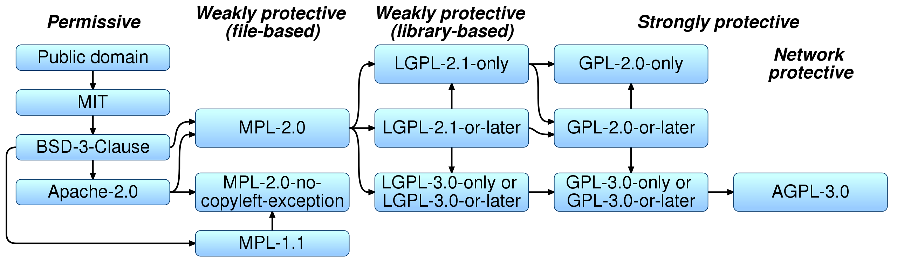
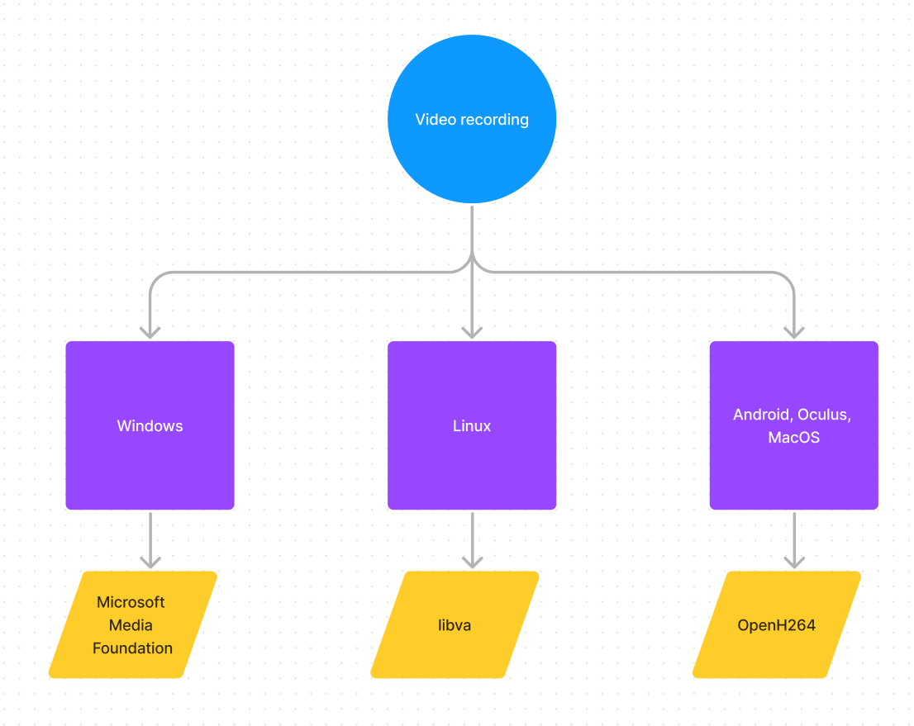
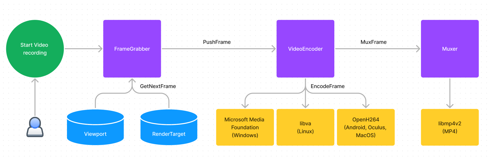

**Intro**

Nowadays people record videos using OS provided tools such as _Record Your Screen_ / _Game Bar (Windows key+Alt+R)_ on Windows, 
`gtk-recordmydesktop` or other software on Linux (need to install it first!), _Screen Recorder_ On Android or _Start recording_ action on Oculus. I assume Mac also has similar functionality. 

The question that I ask in this article is how can a commertial cross-platform program provide a video recording functionality across multiple OS and hardware vendors ideally leveraging hardware acceleration (CPU or GPU)?

In most cases the answer is to use `FFmpeg`. It can encode/record videos on any platform given one has enough time to figure out how it works (list of features goes way way beyond creating videos though). However, decision to incorporate "free software" `FFmpeg` imminently leads to dealing with _Licensing_ and lots of _LEGAL_ stuff. 

**Open-source software and Licensing HELL**

What I recently learned is that an open-source "free" software can easily be not that "open" and not that "free". These days each software piece is protected by the corresponding license. Moreover, there are over 80 open-source licenses! FAANG and other big corps have their own licensing terms. In case you never encountered them before it could be pretty confusing to figure out what license you can use, how you can use it and in what circumstances. In other words, what license will be compatible with your software / system? Below picture outlines only a minor part of the huge problem:



Back to our case. Remember that we want to provide video recording capabilities in our software by integrating `FFmpeg`. We are now educated so we first want to look up `FFmpeg` license: 

```
FFmpeg is licensed under the GNU Lesser General Public License (LGPL) version 2.1 or later. However, FFmpeg incorporates several optional parts and optimizations that are covered by the GNU General Public License (GPL) version 2 or later. If those parts get used the GPL applies to all of FFmpeg.
```

GNU Lesser General Public License (LGPL) by itself should be okay for commercial software but the problem is `FFmpeg incorporates several optional parts and optimizations that are covered by the GNU General Public License (GPL) version 2 or later. If those parts get used the GPL applies to all of FFmpeg.` What I learned from playing with `FFmpeg` build process is that to keep `FFmpeg` LGPL compliant, especially when you want to use _x264_ codec is simply not possible. Why x264? x264 is a fundamental video codec that is performant enough even on low-power mobile devices i.e. mobile phones. Unfortunately, compiling FFmpeg with  `x264` support means GPL applies to whole `FFmpeg` and GPL is a pretty restrictive license for a distributable commercial software to use. Somebody on the internet said this: "Got to love the GPL: Force everything that touches it to be open source". Whether that is good or bad is up to you to decide.

There is more to `FFmpeg` licensing question though:

```
Read the license texts to learn how this affects programs built on top of FFmpeg or reusing FFmpeg. You may also wish to have a look at the GPL FAQ.
```

Even more, `FFmpeg` website contains _License Compliance Checklist_ that consists of 18 steps! Go check [LEGAL stuff](https://FFmpeg.org/legal.html), you will be surprised!

Finally, the cherry on the cake: 
```
Q: Is it perfectly alright to incorporate the whole FFmpeg core into my own commercial product?

A: You might have a problem here. There have been cases where companies have used FFmpeg in their products. These companies found out that once you start trying to make money from patented technologies, the owners of the patents will come after their licensing fees. Notably, MPEG LA is vigilant and diligent about collecting for MPEG-related technologies. 
``` 
This answer is so "beatiful" that I don't even want to comment it. Please take into account that I do not blame `FFmpeg` or feel bad about it. What I am trying to show is sheer amount of mess and madness going on in _licensing_ and _patents_ space. 

To conclude, if you are developing a distributable commercial software (for example a plugin for Unreal Engine) and planning to provide cross-platform and vendor-agnostic video recording capabilities to your users then incorporating `FFmpeg` is not an option anymore. Well, unless you are willing to make the SOURCE of your software/IP available! I suppose many developers say "no" at this step and drop the video recording feature completely. But what if we want to do that but cannot use `FFmpeg`? Well, the answer is simple: use something else, ha-ha!

**Unreal Engine EULA and open-source licenses**

I suppose you didn't come here to read about just about licenses, patents and other boring stuff but please bear with me as I still need to add more details (to completely confuse you, joking!). Therefore, I now start talking about what happens when one uses an open-source software as part of a plugin for Unreal Engine.

Unreal Engine has an extensive [EULA](https://www.unrealengine.com/en-US/eula/unreal) (end-user license agreement) that clarifies how one can use a third party software as part of an application and or even just a single plugin. In particular, 5a "Non-Compatible Licenses" lists:
- GNU General Public License (GPL)
- Lesser GPL (LGPL) (unless you are merely dynamically linking a shared library)
- Creative Commons Attribution-ShareAlike License.

As you can see using `FFmpeg` is a no-go when developing plugins for Unreal Engine due to its license (do not forget GPL licensed x264 codec). Luckily, one can use MIT, Apache or similar licenses... if they find a corresponding open-source software. This is where the whole idea of providing cross platform and vendor agnostic video recording capabilities through the plugin becomes really really complicated. Good news is that I figured out how to answer this question. Jump to the next section!

**Video encoding and video format**

Before we start analyzing the answer I've found to the question I need to mentioned video format and video encoding. Both concepts are super important when trying to find a robust solution to a well-known problem poisoned by licensing issues.

When talking about video recording one usually has to choose video format (for instance, mp4 or mkv?) and encoding or compression method (for example, H.264 or VP9?) for raw RGBA frames. The choice depends on how video is consumed by users (for example, on-demand streaming vs DVD distribution), storage requirements and many many other factors. Using plain RGBA video is very inefficient as there is no compression, which means one have to allocate a lot of resources to simply store such a video and even more bandwidth to send it over the internet.

When outlining an idea for Unreal Engine plugin I decided to pick _H.264_ as compression method and mp4 as container format. H.264 is an industry standard for video compression while _mp4_ is one of the most popular video formats out there. 

**Cross-platform solutions**

Now lets tackle the first part of the problem: cross-platform video recording. Using a cross-platform library or a toolkit helps to avoid OS or platforms specific quirks and allows to get just what we need. Video recording process can be split into two steps:

1. Encode RGBA frames into H.264
2. Mux encoded H.264 frames into mp4 file

Step 1 can be implemented via open-source toolkits: [x264](https://www.videolan.org/developers/x264.html) or [OpenH264](https://github.com/cisco/openh264). As I mentioned earlier, x264 can work if you are developing an open-source application i.e. [OBS](https://obsproject.com/). However, we need a solution for a commercial software. So what about OpenH264? It does work, it provides exactly what we are looking for - H.264 encoding. In addition, OpenH264 has a permissive _BSD 2-Clause Simplified license_, which is perfect for our case and compatible with Unreal Engine EULA. Moreover, OpenH264 can be compiled for literally any platform being used these days, which makes it a perfect candidate.

Step 2 is easy to implement. For example, via [libmp4v2](http://mp4v2.org/). The library has Unreal Engine EULA compatible license so no issues there.

**Vendor-agnostic solutions**

The second part of the problem is implementing a vendor agnostic approach. My research led to the following conclusion: choose between x264 and OpenH264.

As a side note, even though being vendor agnostic might be an optional goal it may have huge benefits. It means the plugin can provide a simple interface to developers, does not require to install hardware-specific drivers and does not care about what hardware users might have. Last bit is especially important as having code that just works on all hardware is a huge pain relief in comparison to dealing with _NVIDIA + NVENC_ or _AMD + VCN_ specific issues.

**x264 vs OpenH264**

I experimented with x264 and OpenH264 and evaluated their performance. I should say that x264 performance is stellar. I tested it on all major platforms (Windows, Linux, MacOS, Android, Oculus) and never had an issue while recording 1080p or 4k. Keep in mind that x264 is a pure software video encoder! There is a plenty of encoder related customization options as well. 

On the other hand, OpenH264 is a free software and has a great license. However, being open-source software it surprisingly lacks feature completion and customization. As for H.264 encoding, OpenH264 supports only a few profiles, which can be pretty limiting for many developers. Neverthless, OpenH264 is good option when basic video recording functionality is required.

I decided to pick OpenH264 as a good fundamental layer to provide the functionality I mentioned earlier. Being open-source and having non-restrictive license means I can integrate it into Unreal plugin without any issues. 

By now we reviewed the most popular open-source cross platform and vendor agnostic solutions but we never touched the topic of leveraging users' hardware to perform video encoding.

**Hardware acceleration**

Providing cross platform vendor agnostic hardware accelerated video recording capabilities is really really tricky. `FFmpeg` toolkit can act as a wrapper for vendor specific libraries/SDKs but integrating it, as you know, is not always possible. OpenH264 does not have any hardware acceleration support nor there are plans to introduce it. So it seems that we have no other good options? Well, that is only half-true. There is a lot of one-sided solutions out there:

- [NVENC](https://developer.nvidia.com/video-codec-sdk) is a video codec SDK that can takes advantange of hardware (GPU). Indeed, this SDK is only for NVIDIA GPU users. 
- [AMD AMF](https://gpuopen.com/advanced-media-framework/) is a video codec SDK that allows video encoding but, again, it is primarily for AMD GPU users.
- [Intel oneAPI](https://www.intel.com/content/www/us/en/developer/tools/vpl/overview.html#gs.2a651h) is a video processing library that covers video encoding but it is designed to get the most out of Intel CPUs and GPUs.

As you can notice above options are all vendor-dependent (licensing-wise they can be tricky, especially NVENC). Moreover, we will need to spend a ton of time integrating each one of them. Please note that I purposefully excluded the platform compatibility question for now as I plan to draw a bigger picture very soon. So is there anything better that integrating three SDKs?
 
**The solution**

The answer is we need to change the original question so that, first, our software can be created and, second, it can be useful for end-users! :) It should sound like this: _"What recording capabilities my users want the most and on which platforms"_? You might think that I am indeed cheating here as I somewhat forgot about all questions I raised above. But main thing that I understood while working on a solution (cross platform vendor agnostic video recording software) is that no matter how brilliant your idea is you need to adapt in order to deliver the value to end-users. I can't chase something that can never happen in license and patents polluted world of video encoding industry.

Before we proceed, I want to share the following assumptions, which should be applicable to end users:

1. Windows: most users usually have either Intel or AMD CPU, discrete NVIDIA or AMD GPU and perhaps integrated Intel GPU. They need to record videos up to 8k in quality and require video to have specific bitrate. Recording peformance should be on par with existing open-source software such as OBS. This means hardware must be used no matter what. 
2. Linux: most users are advanced Windows users :). They will likely have corresponding hardware drivers installed and can manually configure their system to perform video encoding that can take full advantage of their hardware.
3. Android, Oculus: users most likely just want to record the screen (for example, the game they are playing). They don't care that much about video encoding parameters except for resolution, which should match device's screen size. The device hardware may or may not be used as long as they can tolerate the recording performance.

Taking into account the assumptions above I found the following approach to work the best for majority of users:

- Windows: use Microsoft Media Foundation - [MMF](https://learn.microsoft.com/en-gb/windows/win32/medfound/microsoft-media-foundation-sdk)
- Linux: use [libva](https://github.com/intel/libva)
- Other platforms (Android, Oculus, MacOS): use [OpenH264](https://github.com/cisco/openh264)

Windows Media Foundation is a an end-to-end media pipeline, which supports playback, audio/video capture, and encoding (successor to DirectShow). 

Libva is an implementation for VA-API (Video Acceleration API). VA-API is an open source application programming interface that allows applications to use hardware video acceleration capabilities, usually provided by the graphics processing unit (GPU). GPU driver must be installed. Interesting thing about libva is that Windows setup also exists but quite tricky to get right (I never managed). I really hope libva will become somewhat a cross-platform API at some point but hard to say when this happens.

OpenH264 is an open-source framework that provides basic H.264 encoding capabilities and fully platform and vendor agnostic (super handy for non-Windows and non-Linux platforms).

All three SDKs provide the best vendor-agnostic(!) support and feature set to deal with video encoding. The best here means both performance and hardware acceleration (where applicable).

As you may have noticed, we stopped taking whether something is a cross-platform into account. This is on purpose as open-source _cross-platform_ vendor agnostic video encoding solution with the license compatible with Unreal EULA simply does not exist. If you found one then please let me know!

The picture below summarizes everything we learned about the problem and provides a framework to implement a robust solution:



**Unreal Engine code snippets**

Unreal Engine C++ interface might look similar to this one:
```
class IRuntimeVideoEncoder
{
public:
    virtual ~IRuntimeVideoEncoder() = default;

    virtual bool Initialize(int32 InWidth, int32 InHeight, int32 InFPS, int32 Bitrate, const FString& InFilename) = 0;
    virtual bool StartEncoding() = 0;
    virtual bool StopEncoding(bool bForceStop = false) = 0;
    virtual bool IsEncoding() const = 0;

    virtual void PushFrame(TArray<uint8>&& FrameData, int32 FrameWidth, int32 FrameHeight) = 0;
};
```

Platform dependent implementations can be easily hidden in .cpp files and thus not exposed to an end user. The interface also encapsulate the idea of video encoding pipeline through `PushFrame(...)` function. It tells developer to pass only FrameData (basically RGBA) and the rest is implementation details.

Example Windows MMF encoder class:
```
class FWMFVideoEncoder : public FBaseVideoEncoder
{
public:
    virtual ~FWMFVideoEncoder();

protected:
    bool InitializeEncoder_Implementation() override;
    void DeinitializeEncoder_Implementation() override;
    bool EncodeSingleFrame_Implementation(TArray<uint8>&& FrameData) override;
    void FlushSamples_Implementation() override;

private:
    bool EncodeSingleFrameWMF(IMFSample* pSample, IMFMediaBuffer* pBuffer, IMFSample* pH264EncodeOutSample);

private:
    // Windows MFT https://learn.microsoft.com/en-us/windows/win32/medfound/media-foundation-transforms
    IUnknown* spEncoderTransfromUnk = nullptr;
    IMFTransform* pMFT = nullptr; // This is H264 Encoder MFT.
    IMFMediaType* pTypeIn = nullptr;
    IMFMediaType* pTypeOut = nullptr;

    IMFSinkWriter* pSinkWriter = nullptr;
    DWORD writerVideoStreamIndex = 0;

    DWORD m_dwInputID = 0;     // Input stream ID.
    DWORD m_dwOutputID = 0;    // Output stream ID.
};
```

Overall Unreal plugin architecture looks like this:




**Failed experiment: Android MediaCodec**

My attempt of using [Android MediaCodec](https://developer.android.com/reference/android/media/MediaCodec) to enable hardware accelerated video encoding on mobile devices has failed. Main reason is MediaCodec being notoriously bad with respect to input data format. There are well-known issues related to Android video encoders:

- Input data must be be aligned ([1](https://stackoverflow.com/questions/21380478/android-mediacodec-omx-st-vfm-h264enc),[2](https://stackoverflow.com/questions/6645724/h264-encoder-in-android?rq=3)) in a specific way (it is hard to figure out the correct approach to transform input data due to Android encoders being implemented by different vendors as well corresponding implementations are not published anywhere)
- Only some frame resolutions are supported. Probably due to encoder specific implementation details. 
- To implement a robust system (that works across many devices) one has to pass data through [Surface](https://developer.android.com/reference/android/view/Surface) rather than [InputBuffer](https://developer.android.com/ndk/reference/group/media#amediacodec_dequeueinputbuffer), which makes the Unreal frame data encoding flow (from  RGBA frames to encoded H.264 frames) really sophisticated as one has to use OpenGL ES to fill such Surface with data each frame.

After few days of experiments and debugging I dropped this approach as highly fragile one.

**Failed experiment: SVT-AV1**

Just for fun one I incorporated [SVT-AV1](https://gitlab.com/AOMediaCodec/SVT-AV1) encoder into Unreal plugin. Good news - it works. Bad news - it is super slow (in comparison to x264 or OpenH264) even on 16-core Ryzen CPU machine! That was a sign the encoder is unfortunately a no-go, especially for not so powerful devices. I believe there might be a way to take advantage of SVT-AV1 given that Netflix uses it [in production](https://netflixtechblog.com/bringing-av1-streaming-to-netflix-members-tvs-b7fc88e42320) but hard to say without experimenting more. If you have any ideas please share them somewhere!

**Epilogue**

In the end I managed to create a new plugin for Unreal Engine - `Runtime Video Recorder`. It implements a video encoding pipeline using MMF and OpenH264. I wish I could add libva too but unfortunately I don't think there is enough demand (read as potential Linux users of the plugin) to start incorporating libva. I `published Runtime Video Recorder` on Unreal Marketplace (there will be the link very soon!). Besides that, I provided some compiled `x264` library here in case somebody wants to experiment implemeting a custom x264 video encoder in [Github repo](https://github.com/UnrealSolutionsLtd/RuntimeVideoRecorderLibs)

Overall, I learned quite a lot about video encoding and problem domain but whole thing left me with mixed feelings. I hope you found this blog post useful and feel free to drop me a message if you want to chat about it.
